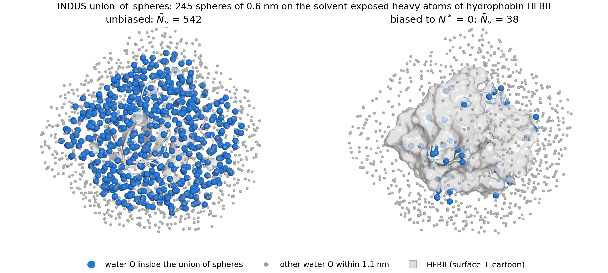

# indus
Implements the INDUS method for several probe volume geometries. Primarily for use as part of PLUMED.

Questions, comments, and concerns should be directed to the [INDUS Users' Google Group](https://groups.google.com/g/indus-users).

## Probe volumes

`sphere`, `box`, `cylinder`, and `union_of_spheres`. The union of spheres places one sphere
(or spherical shell) on each position listed in a plain-text file and counts a water once no
matter how many spheres it falls in: the coarse-grained indicator is
`htilde_v = 1 - prod_k (1 - htilde_k)`. Centers are static. A typical use is the hydration
shell of a solute, with one sphere on every solvent-exposed heavy atom:

```
ProbeVolume = {
	type  = union_of_spheres          # alias: union_of_spherical_shells
	r_max = 0.6                       # [nm]; optional r_min for shells
	reference_positions_file = centers.pos   # one "x y z" (nm) per line, '#' comments
	sigma   = 0.01
	alpha_c = 0.02
}
```



*Hydrophobin HFBII (PDB 2B97) in SPC/E water, protein heavy atoms restrained. Left: unbiased,
542 waters inside the union of 0.6 nm spheres on the 245 solvent-exposed heavy atoms. Right:
after a harmonic restraint on Ntilde (PLUMED `MOVINGRESTRAINT`, kappa = 0.5 kJ/mol) was ramped
from 542 to 0 over 2 ns and held at 0 for 1 ns, 38 waters remain. GROMACS 2024.3 + PLUMED 2.9.4
built with the installer below; rendered with open-source PyMOL from
`doc/images/hfbii_union_of_spheres_dewetting.pml`.*

## Building the whole stack

`scripts/install/install_indus_stack.sh` builds a tested INDUS + PLUMED + GROMACS stack from
pristine sources into one prefix (defaults: PLUMED 2.9.4, GROMACS 2024.3, MPI on, CUDA if
`nvcc` is found). Every setting is an environment variable; see the header of the script.

```
MPICC=/path/to/mpicc MPICXX=/path/to/mpicxx CUDA_HOME=/usr/local/cuda \
    scripts/install/install_indus_stack.sh --root $HOME/programs/indus-stack
source $HOME/programs/indus-stack/gromacs-2024.3_plumed-2.9.4/env.sh
```

The last phase runs the standalone regression tests (`test/`), the PLUMED-driver tests
(`plumed_patch/test/`), and a short MD with INDUS active, and writes a manifest with versions,
flags, and results.

## Tests

`make check` (or `ctest` in the build directory) runs the standalone driver against stored
reference outputs. The references for `union_of_spheres` were validated independently with
PyTorch autograd; see `test/reference_generators/`.
