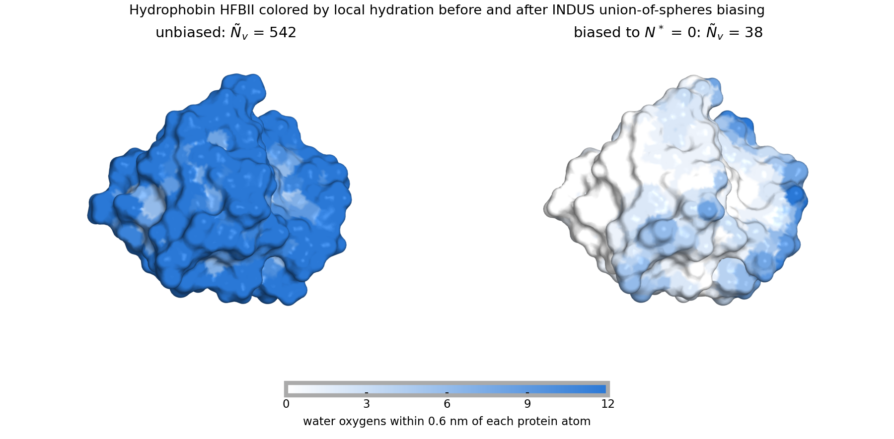

# INDUS

[](https://github.com/patellab511/indus/actions/workflows/tests.yml)

INDUS (INDirect Umbrella Sampling) biases the coarse-grained number of waters, Ñ<sub>v</sub>,
inside a probe volume *v*, so that the free energy of emptying that volume can be measured
with umbrella sampling. The coarse-graining makes Ñ<sub>v</sub> a smooth function of the atomic
coordinates, so it can be biased in molecular dynamics. This code implements INDUS for several
probe volume geometries, as a PLUMED action for biased simulations and as a standalone program
for analyzing trajectories.

- A. J. Patel, P. Varilly, D. Chandler, *J. Phys. Chem. B* **114**, 1632 (2010)
- A. J. Patel, S. Garde, *J. Phys. Chem. B* **118**, 1564 (2014)

Questions, comments, and concerns should be directed to the
[INDUS Users' Google Group](https://groups.google.com/g/indus-users). The full input reference
is in `manual/plumed_indus_manual.pdf`.

## Probe volumes

| `type` | Geometry | Main keys |
| --- | --- | --- |
| `sphere` | sphere or spherical shell | `center`, `r_max`, optional `r_min` |
| `box` | axis-aligned box | `x_range`, `y_range`, `z_range` |
| `cylinder` | cylinder along x, y or z | `axis`, `base`, `radius`, `height` |
| `union_of_spheres` | union of spheres (or shells) on a list of fixed positions | `reference_positions_file`, `r_max`, optional `r_min` |

All take `sigma` (default 0.01 nm) and `alpha_c` (default 0.02 nm) for the coarse-graining.

The union of spheres counts a water once no matter how many spheres it falls in: the
coarse-grained indicator is `htilde_v = 1 - prod_k (1 - htilde_k)` over the spheres *k*, and
its derivative follows from the product rule. The centers are static and come from a plain
text file with one `x y z` (nm) per line. A typical use is the hydration shell of a solute,
with one sphere on every solvent-exposed heavy atom:

```
ProbeVolume = {
	type  = union_of_spheres          # alias: union_of_spherical_shells
	r_max = 0.6                       # [nm]
	reference_positions_file = centers.pos
	sigma   = 0.01
	alpha_c = 0.02
}
```

## Example: dewetting hydrophobin HFBII

Hydrophobin HFBII (PDB 2B97, chain A, 70 residues) in SPC/E water with AMBER99SB-ILDN, protein
heavy atoms position-restrained. The probe volume is the union of 0.6 nm spheres on the 245
solvent-exposed heavy atoms, found with `gmx sasa`. Unbiased, the union holds Ñ<sub>v</sub> =
542 ± 8 waters over 5 ns. A harmonic restraint on Ñ<sub>v</sub> (PLUMED `MOVINGRESTRAINT`,
kappa = 0.5 kJ/mol) was then ramped from 542 to 0 over 2 ns and held at 0 for 1 ns.



*Surface colored by the number of water oxygens within 0.6 nm of each protein atom, at
Ñ<sub>v</sub> = 542 (unbiased), 282, 151 and 38 (end of the hold). The dashed outline is the
hydrophobic patch (Leu7, Val18, Leu19, Leu21, Ile22, Val24, Val54, Val57, Ala58, Ala61,
Leu62, Leu63), the face with which HFBII adsorbs at the air-water interface. It is the first
region to dewet; the water that remains at the end sits near polar and charged residues on
the opposite face (Thr30, Asp34, Lys49, Lys66, Gln60, the N-terminus). Rendered with
open-source PyMOL and composed with the scripts in `doc/images/`.*

The inputs are in `examples/hfbii_dewetting/`.

**Throughput on this system** (18,451 atoms; 5,823 water oxygens against 245 spheres evaluated
every step), GROMACS 2024.3 + PLUMED 2.9.4 from the installer below, one AMD Ryzen 9 5900X
(12 cores) and one NVIDIA RTX 3080, 2 fs steps, 3000-step benchmarks. Every row uses 12
threads in total, split between MPI ranks and OpenMP threads per rank:

| ranks x threads | GPU + INDUS | CPU + INDUS | GPU, no INDUS | CPU, no INDUS |
| --- | --- | --- | --- | --- |
| 1 x 12 | 149 | 71 | 664 | 101 |
| 2 x 6 | 107 | 71 | | |
| 3 x 4 | 122 | 77 | | |
| 4 x 3 | 119 | 77 | | |
| 6 x 2 | 124 | 71 | | |
| 12 x 1 | 67 | 59 | 52 | 132 |

ns/day. The same benchmark on a cluster node (chestnut at Penn: two 16-core Intel Xeon
E5-2683 v4 at 2.1 GHz, no GPU, built with the installer under gcc 9.2 and OpenMPI 4.1),
using one full socket of 16 cores per row:

| ranks x threads | CPU + INDUS | CPU, no INDUS |
| --- | --- | --- |
| 1 x 16 | 55 | 95 |
| 2 x 8 | 53 | |
| 4 x 4 | 54 | |
| 8 x 2 | 51 | |
| 16 x 1 | 46 | 97 |

Going from 12 to 16 cores gained about 20 percent, so the system still scales at this size.
The layouts from 1 x 16 to 8 x 2 are equivalent within the run-to-run noise of these short
benchmarks; only one thread per rank is clearly slower. For production on such a node: one
16-core socket per umbrella window, as one rank with 16 threads or a few ranks with several
threads each, two windows per node; a 3 ns window takes about 80 minutes.

INDUS runs on the CPU inside PLUMED and, with this many spheres, sets the step time: the GPU
gives a factor of two with INDUS active against a factor of six for plain MD. INDUS
distributes the target atoms over MPI ranks by domain decomposition, so the per-atom work is
shared either way; what grows with the rank count is the per-step overhead (every rank
classifies all targets against the decomposition grid, receives all requested atoms from
PLUMED, and takes part in the derivative exchange). That overhead is negligible up to a few
ranks and about 15 percent at one thread per rank. On a single shared GPU, many ranks are
much worse for GROMACS itself (52 ns/day at 12 x 1 without INDUS). The standalone driver
processes the same system at about 45 ms per frame on 24 threads. The brute-force search
over centers is the obvious target for a cell list.

## Installation

### Everything at once

`scripts/install/install_indus_stack.sh` builds a tested stack from pristine sources into one
prefix: PLUMED with INDUS patched in, GROMACS patched with that PLUMED (runtime mode), and the
standalone driver, followed by the tests below and a manifest with versions, flags and
results. Defaults are PLUMED 2.9.4 and GROMACS 2024.3 with MPI, OpenMP, and CUDA when `nvcc`
is found; tarballs are checksum-verified. Every setting is an environment variable, and
`--print-config` shows the resolved values before anything is built.

```
scripts/install/install_indus_stack.sh --print-config
MPICC=/path/to/mpicc MPICXX=/path/to/mpicxx CUDA_HOME=/usr/local/cuda \
    scripts/install/install_indus_stack.sh --root $HOME/programs/indus-stack
source $HOME/programs/indus-stack/gromacs-2024.3_plumed-2.9.4/env.sh
```

`--no-mpi` and `--no-gpu` select the lighter builds; `--only <phase>` and `--from <phase>`
rerun or resume. Worked examples for a GPU workstation, a CPU-only laptop, and a cluster with
modules, plus troubleshooting, are in [`scripts/install/README.md`](scripts/install/README.md).

### Standalone driver only

Needs CMake 3.15+ and a C++11 compiler; the xdrfile library for reading xtc files is included.

```
cmake -S . -B build -DCMAKE_BUILD_TYPE=Release -DMPI_ENABLED=ON -DOPENMP_ENABLED=ON -DGPTL_ENABLED=OFF
cmake --build build -j
build/bin/indus indus.input      # with GroFile and XtcFile set in indus.input
```

Set `-DMPI_ENABLED=OFF` to build without MPI. `make check` runs the regression tests.

### Into an existing PLUMED source tree

```
plumed_patch/patch_plumed.sh /path/to/plumed2        # copies src/ into a PLUMED module
cd /path/to/plumed2
CXXFLAGS="-O3 -fPIC -std=c++11 -fopenmp -DMPI_ENABLED" ./configure --prefix=... --enable-mpi
make -j && make install
```

Then patch your MD code with PLUMED as usual. In `plumed.dat`:

```
indus: INDUS INPUTFILE=indus.input
r: RESTRAINT ARG=indus.ntilde AT=20.0 KAPPA=0.5
PRINT ARG=indus.n,indus.ntilde,r.bias STRIDE=100 FILE=plumed.out
```

## Tests

- `ctest` in the build directory (or `make check`): the standalone driver against stored
  reference outputs for every probe volume, serially and with 4 MPI ranks x 2 OpenMP threads.
  The GitHub Actions workflow runs this on every push.
- `plumed_patch/test/run_tests.sh <plumed>`: INDUS inside PLUMED via `plumed driver`, one test
  per probe volume on the same trajectories as the standalone tests. Their references were
  checked against the standalone references (identical forces to the printed precision).
- `test/reference_generators/`: PyTorch autograd re-implementations that validate the
  reference outputs independently of the C++ (need `torch` and `MDAnalysis`; not part of
  `ctest`). The `union_of_spheres` references match autograd on all 5,823 water oxygens of the
  HFBII frames to 5e-6 kJ/mol/nm.
- The installer's test phase runs all of the above plus a short MD with INDUS active under
  the built GROMACS, checking PLUMED's Ñ<sub>v</sub> against the standalone driver at every step.

## Layout

```
src/orderparameters/   the code: probe volumes, Indus, switching functions, MPI/OpenMP wrappers
src/driver/            main() of the standalone program
src/xdrfile/           vendored xtc/trr reader
plumed_patch/          PLUMED module files, patch script, PLUMED-driver tests
scripts/install/       all-in-one installer
test/                  regression tests, sample trajectories, reference generators
examples/              hydrophobin dewetting inputs
manual/                LaTeX manual (input reference, umbrella sampling guidance)
doc/images/            README figures and the PyMOL script that renders them
```

## License

Copyright (C) 2018-2026 The Trustees of the University of Pennsylvania. INDUS is distributed
under the University of Pennsylvania non-commercial research license in [`LICENSE`](LICENSE):
free to use, copy, and modify for non-profit research, with no distribution to commercial
third parties without Penn's written approval. For commercial use contact the Penn Center for
Innovation (215-898-9591). Versions up to the git tag `mit-license-final` were released under
the MIT license, which continues to apply to those versions.
